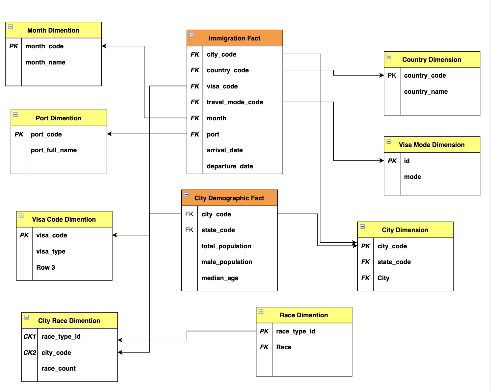

# Description
- This project is planned to analyse data of immigrants which move to US so that it could be helpful to get know about the immigrants, their reason for travel and how they travelled. This will help in regulating immigration process.

- This project will also provide a better view of the destination,its weather and demographics to help immigrants in suitable manner and can be used by Travel Agencies to update their clients(travellers) with suitable data like weather,temprature,population stats of their destination location.

- The end user of this project could immigration regulatory commitee or the  travel agency or the immigrant intself .

- If the immigration regulatory feels to restrict some data points to the travel agencies to be accessed  due to security reasons, that could be done with proper governance on the database end. So we have not covered the governance part here.

- For this project we have used various data sources(Listed below). We built a  Data Ware-House with Fact Constellation Schema Model or (Galaxy Data Warehouse Model) on AWS Redshift that can be used  by immigration regulatory commitee or the immigrants to query the immigration ,demographics,weather or immigrants related data . Regulators can get help understanding how immigration are arriving , what are their modes and reason to travel ,which will help them make there decisions better.
Also the travel agencies can also use this data warehouse to provide their clients(travellers) better info about their destination as a  personalised overview.


# Data sources used in Project
- 1). I94 Immigration Data: This data comes from the US National Tourism and Trade Office [Source](https://travel.trade.gov/research/reports/i94/historical/2016.html). This data records immigration records partitioned by month of every year.
- 2). World temperature Data: This dataset comes from Kaggle [Source](https://www.kaggle.com/berkeleyearth/climate-change-earth-surface-temperature-data). Includes temperature recordings of cities around the world for a period of time
- 3). US City Demographic Data: This dataset comes from OpenSoft [Source](https://public.opendatasoft.com/explore/dataset/us-cities-demographics/export/). Includes population formation of US states, like race and gender.
- 4). Additional data sources - I94_SAS_Labels_Descriptions.SAS . This  file comprises of Static Meta data which is used as dimentions in the data warehouse Model after manual extraction in individual files.
    - Visa_type.txt
    - port_details.txt
    - country_codes.txt


# Tech Stack , Infra Details & why they were picked?
- **Cloud provider** - AWS
    - AWS is just used because of simplicity and previous experience with it , we could have also gone for Microsoft Azure or GCP . Azure also provides data managed warehouse capabilities and can be used to make a highly scaled up data warehouse
    - AWS Redshift was picked beacuse one can create and access the cluster faster than Azure DW.
- **Data Processing** - Apache Spark 2.4 in Python (PySpark)
    - I beleive Apache Spark is  one of the best open-source framework to process both Structured , Unstructured data & streamimg data.
    - Spark also adds capabilities to enormously scale your data procesing jobs horizontally and runs on comodity hardware in distributed mode.
    - We could have also used DASK framework in Python if our data would have been less or even Apache Presto as a SQL Engine to store and process the data in case we had less complex transformations or say straight forward SQL compatible operations.
- **Hadoop Cluster Service** - AWS EMR 5.28.0
    - **Applications on EMR** -
        - Spark - For structured data processing
        - Hadoop - Spark underlyingly works on Hadoop
        - Ganglia - For monitoring spark jobs
        - JupyterHub - For development , we could have also used Zepplin Notebooks , but JupyterHub provides much better integrated env for development
        - Livy - For managing spark sessions
    - Since we are on AWS cloud that's why we have used EMR , if we could have also used Databricks Hadoop Cluster or Azure HD Insight if we were on a different cloud provoder.
- **Data Storage (Data Warehouse)** - AWS Redshift
        - 2 Dc2Large Nodes (Cost effective & high performance)
        - For simplicity, fast availability and cloud managed like capabilites, we opted for Redshift.
        - We could have also opted for Azure Data warehouse if we were on Azure Clould.
        - We could also opted for Apache Hive as a data warehouse solution , but it comes with its own maintainence overhead and performance restrictions. Since Apache Hive is based on Map-Reduce , it takes more time to ,process and join data sets .
        - Redshift on the other Hand is fast and solely built for those complex computations.
- **File Storage Service** - AWS S3
    - AWS S3 provides much higher throughput as compared to any other file storage option.
    - AWS S3 is also a cost efficient ,scalable (doesn't requires scaling up , scales up automatically) and reliable option of file storage
    - We could have also used HDFS of we were on open-source or Azure Blob Storage if we were on Azure

# Data Warehouse Model , Fact Constellation Schema,Tables Description

## Why a Data Warehouse ?
- A data warehouse will give scalability on our storage layer as the Redshift cluster can scale upto 100's of nodes to store TB's of data without compromising performance.
- Horizontal Scalability , no single point of failure.
- A data warehouse is built and highly optimised for complex aggregations and queries.
- High performance , as a data warehouse provides results much faster
    - Use of Sort Keys - for faster extraction
    - User of Dist Keys - for optimal data storage,avoids skewness and give faster results.
- High Cardinality - With a data warehouse model it is easier to maintain high cardinality among the data sets as the data is normalised among fact and dimension tables.
- Easy to make upserts without compromising cardinality and easy to maintain

## Fact Constellation Schema Model (Galaxy DW Schema)
- Our Galaxy Schema has 2 fact tables - ``immigration_fact`` and ``city_demographics_fact`` and 8 Dimention Tables -
    - ``port_code_dimention``
    - ``visa_code_dimention``
    - ``visa_mode_dimention``
    - ``country_code_dimention``
    - ``month_names_dimention``
    - ``city_dimention``
    - ``race_dimention``
    - ``city_race_dimention``


-                           Data Warehouse Model


- The dimention tables data is almost static and doesn't require upserts , while upserts can easily be done in the fact table
- By adding more dimention tables , we have ensured high cardinality in the fact tables data.

## Tables Description

- ``port_code_dimention`` - Built from data source 4 and comprise of Port Code and Port Name
- ``visa_code_dimention`` -Built from data source 4 and comprise of  Visa Code and Visa 
- ``visa_mode_dimention`` - Built from data source 4 and comprise of Visa Mode Code and Visa Mode
- ``country_code_dimention`` - Built from data source 4 and comprise of  Country Code and Country Name
- ``month_names_dimention`` - Built on demand and comprise of MonthID and Month Name
- ``city_dimention`` - Built by combination of data source 2 & 3 , gives complete view of City level data. Can be joined with both fact table by foreign key as ``City_Code``
- ``race_dimention`` - Consists of dynamically created race_type_id and Race Type name. Improves cardinality of city_demographics_fact.
- ``city_race_dimention`` - This dimention table is specially Created to improve Cardinality of City_Demographics_Fact table . 
        - Comprise of City_Code , Race_Type_Id and Race_Count in the respective City. 
        - Race_count is type of ``SCD(Slowly Changing Dimention)`` . This value wont be updated frequently ans Census in US happens only once in 10 years.

- ``city_demographics_fact`` - Consists of City Level quantitative data which gives a complete view of Cities in US(Filtred from superset). 
        - Can be joined with dimention tables to enrich data - city_dimention,race_dimention,city_race_dimention

- ``immigration_fact`` - Gives a complete view for all immigration related data for US .
        - Can be joined with following dimention tables , to enrich datasets - port_code_dimention,visa_code_dimention,visa_mode_dimention,country_code_dimention,city_dimention,month_names_dimention


# Implementation

## Code Details

```
|__ etl.py
|__ spark.cfg
|__ utils.py
|
|__ data
|   |__ immigration_data_sample .csv
|   |__ us-cities-demographicscsv.csv
|
|__ extra_data__
|   |__ country_codes.txt
|   |__ port_details.txt
|   |__ Visa_type.txt
|
|__ Data_Warehouse_data_model.png

**NOTE** - Immigrations data SAS file and GlobalLandTemperaturesByCity.csv was very large , so I haven't put here , to be kept accordingly before job run inside data folder.
```
- etl.py - Where all transformations happen in pyspark
- spark.cfg - Where all the redshift related and access related configs are stored.
- utils.py - Python Utilities to read and clean additional data 

- extra_data - Self created data sets from I94_SAS_Labels_Descriptions.SAS  file

## Code Deployment 

- Update ``Spark.cfg`` file with IAM role,S3 bucket ,Redshift Credentials & Redshift Schema Name
- Push Code files and data files to S3
- Create EMR Cluster
- Use EMR bootstrap functionality to install python packages on nodes , download code and related data files from S3 & also download required external jar's for spark jobs
- Once the cluster is ready with bootstrap task, do ssh into the master node of EMR(** You can define EMR step as well)
- Run the following command to run spark job

<pre><code>
/usr/bin/spark-submit \
--master yarn \
--jars /home/hadoop/jars/RedshiftJDBC41-1.2.12.1017.jar,/home/hadoop/jars/minimal-json-0.9.4.jar,/home/hadoop/jars/spark-avro_2.11-3.0.0.jar,/home/hadoop/jars/spark-redshift_2.10-2.0.0.jar,https://s3.amazonaws.com/redshift-downloads/drivers/jdbc/1.2.36.1060/RedshiftJDBC42-no-awssdk-1.2.36.1060.jar \
--packages org.apache.spark:spark-avro_2.11:2.4.2,io.github.spark-redshift-community:spark-redshift_2.11:4.0.1 \
--files spark.cfg,utils.py \
/home/hadoop/etl.py
</code></pre>

- The Execution takes about 15 minute to complete
- Review the tables in Redshift
- Terminate EMR Cluster


## Possible issues/errors
- Spark-Redshift Jars not found, recheck the Jar version & spark-submit command 
- Make sure Pyspark file and utility and config files and present in same folder

## Data Quality Checks 
We perform two types data quaility checks on the data
- Check wether the data set to be inserted in warehouse is empty or not
    - In case of this check failure , either there is an issue while processing the data in the tranformation logic, or the source data itself hasn't arrived yet.

- Check wether there are any duplicates in the data set processed. 
    - If this fails, then there could be an issue in tranformation logic , due to which duplicates are present
    - Or , the source data itself has duplicates and the issue can be reported to the respective data owner
    - In case of failure, this check also tell the absolute difference between the original count and de-dup count, to better analyse the severiety of the issue.


# Data Dictionary 
## Dimention Tables
### 
- ``port_code_dimention`` -
    - port_code- 3 Digit string  unique code
    - port_full_name - Port Name String

- ``visa_code_dimention`` - 
    - visa_code - Visa Type Code String
    - visa_type - Visa Type String

- ``visa_mode_dimention`` - 
    - id - Unique id for Travel Type
    - mode - Travel type/Mode (Air,Sea,Road,Not Reported)

- ``country_code_dimention`` -
    - country_code - 3 Digit Integer unique country code
    - country_name - Country Name String

- ``month_names_dimention`` - 
    - month_code - Unique code for month (1 for Jan, 12 for Dec respectively)
    - month_name - Month String

- ``city_dimention`` - 
    - City - US City Name - String
    - State - US State Name - String
    - state_code  - US State Code , unique - String
    - city_code - US City Code , unique - INT

- ``race_dimention`` -
    - Race - Name of the  People Race 
    - race_type_id - Unique Id respective to that race INT

- ``city_race_dimention`` - 
    - city_code - Unique City Code INT
    - race_type_id  - Unique Id of Race_Type INT
    - race_count - Count of People of the respective race type and in the respective city

## Fact Tables -

### 
- ``city_demographics_fact`` -

    - city_code - Unique City Code INT
    - state_code - US State Code , unique - String
    - total_population - Total Population of the City
    - male_population - Male Population of the City
    - female_population - Female Population of the City
    - number_of_veterans - Veterans Population of the City
    - median_age - Median Age of the City
    - foreign_born - Count of population born outside the city 
    - average_household_size - Average number of people in a home in the respective city

### 
- ``immigration_fact`` - 
    * port_code - 3 Char Port Code (FK for port_dimention)
    * state_code - 2 Char State Code (FK for City dimention)
    * count - Used for Summarry Statistics
    * visa_post - Department of State where Visa was Issued
    * occupation - Occupation that will be performed in U.S.
    * gender - Gender Code(M- Male,F - Female, Null for Unknown)
    * insnum - INS Number
    * airline - Airfline Code
    * adm_num - Admission Number of Immigrant
    * flight_number - Flight Number of Airline
    * visatype -  Class of admission legally admitting the non-immigrant to     temporarily stay in U.S (F1,B1,B2 etc)
    * travel_mode_code - Int code for travel mode (FK for visa_mode_dimention table)
    * visa_code - Int code for Visa applied type (FK for visa_code_dimention table)
    * month - Numeric Month Code (FK for month_dimension table)
    * year - 4 digit year
    * age - Age of Immigrant at the time of travel
    * birth_year - Birth year of Immigrant
    * city_code - 3 Digit City Code (FK for city dimention)
    * country_code - 3 Digit Country Code (FK for country_dimention)
    * cic_id - Unique Id
    * arrival_date - Arrival date of Immigrant
    * departure_date - Departure date of Immigranr
    * date_added_i_94_files - Character Date Field - Date added to I-94 Files
    * date_till_allowed_to_stay -  Character Date Field - Date to which admitted to U.S. (allowed to stay until)

# Scenarios
-  What if the data was increased by 100x ?
Two things needs to be addressed while an increase of the source data i.e Storage & Compute
    - **Storage** - Our Storage Engine is AWS Redshift and can scale upto 100's of Nodes to store Petabytes scale of the . If the data is heavily large we can use Redshift **RA3 Type Nodes** , which is built for storing massive data with underlying storage layer on S3. 
    This Solution will be good for Read heavy workloads
        - But if we observe that the source data is updating very frequently i.e (many times a day), then we have to look upon another approach as Redshift wont be a good fit to perform heavy reads and writes at the same time
        - We can replace our data warehouse model with **Data Lake Model** . With this our data processing layer will remain same , only just our data storage layer will change and we need to bring a Data Lake Management Framework in place like **(Databricks Delta Lake or Apache Hudi)**
        - This will give us enormous scalability as underlying storage will be on S3
        - All it will give high throghput to perform reads and writes at the same time , without compromising the performance.

    - **Compute** - Scaling the compute will be a bit straight forward as we need to increase the EMR cluster size according to the size of the data. 
        - Also if we are not sure about the size , then we can use EMR autoscalling feature to manage change in workloads ,without  any need to manage it yourself.
   


- What if the pipelines would be run on a daily basis by 7 am every day.
    - We can do this with Airflow , we just need to integrate ourEMR  Spark job with Airflow DAG and keep the scheduling time to 7 AM and frequency as daily
    - We can also do this by creating a cloud watch event , which can trigger a Lambda Function to Launch the EMR Cluster
        - We can specify our spark-submit commands in EMR steps and required packages,jars,code or data in EMR bootsrap feature and every things will run on its own.
        - The above approach of scheduling the pipeline is completely serverless while the former Airflow , require a server.
        - We can choose the best as per our need.
   


- What if the database needed to be accessed by 100+ people ?
    - **By using User Groups**
        - As our end users of the data could belong to different worlds/domain , so can create different user groups and provie access to each group according to there need.
        - By this way we can create 100+ users on Redshift , but don't have to micro manage them individually but control all the governance on user group level , making the lives of DBA's a bit easier.
        - We can add , remove users from the group as per the needs.
    - **By using WLM**
        - Incase users feels that there queries are taking more time to give results due to many parallel queries running on cluster, then we can use Redshift's Workload Mangamemt Techniques in which we can prioritise the queries of critical clients of the data as compared to non-critical clients.
        - We can assign User groups to WLM queues to manage the workload better.
        


