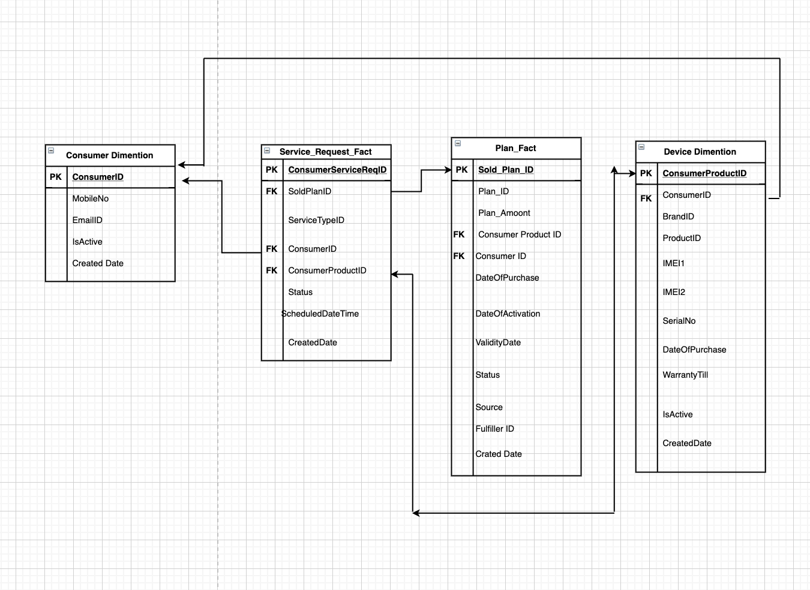

# Data Warehouse Dimentional Model

## Hybrid Schema Model - Extension of Star Schema

### Dimention Table
- Consumer Dimention
- Device Dimention

### Fact Tables
- Service_Request_Fact
- Plan_Fact

### Why this Schema
- Have choosen two fact tables beacause , there are 2 actions/events happening i.e Service Request raised by customer and plan sold by enterprise
- The rest of the data are simply the attributes of these events and are captured as dimentions
- Consumer Dimention comprises of Custmomer related information 
- Device Dimention comprises of device(Product) related information