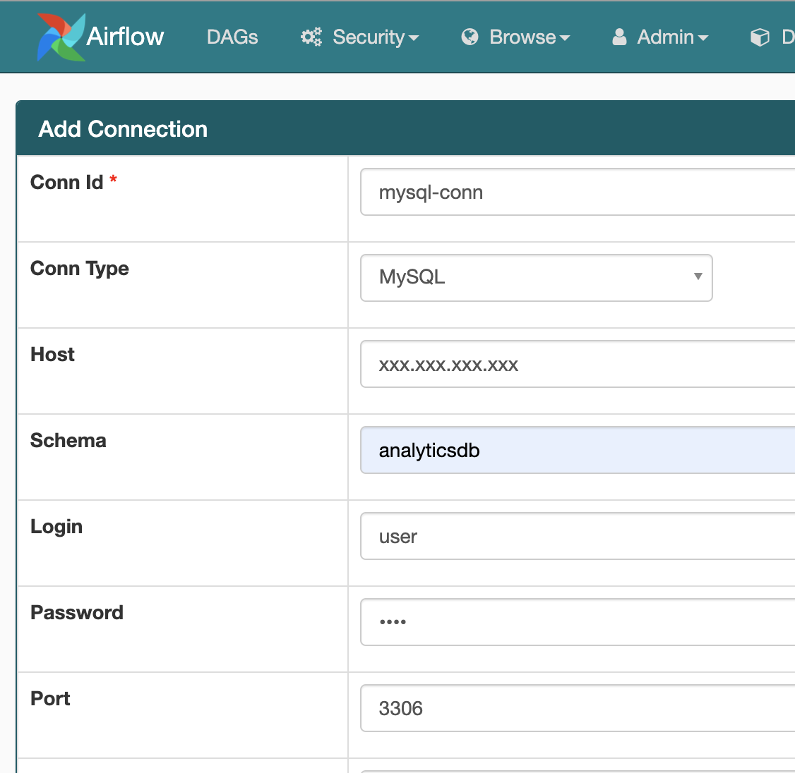
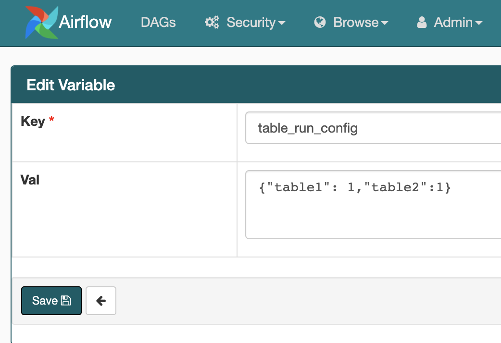
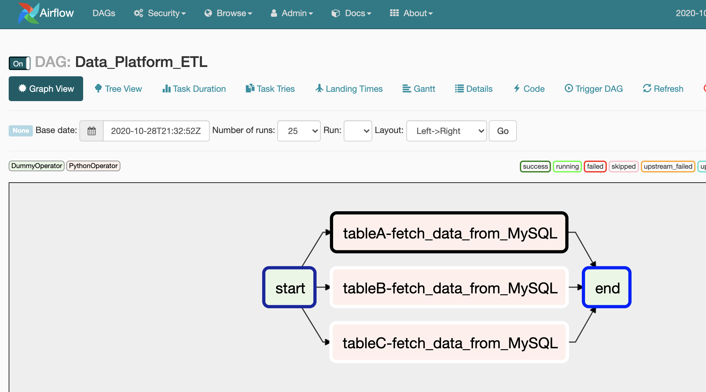
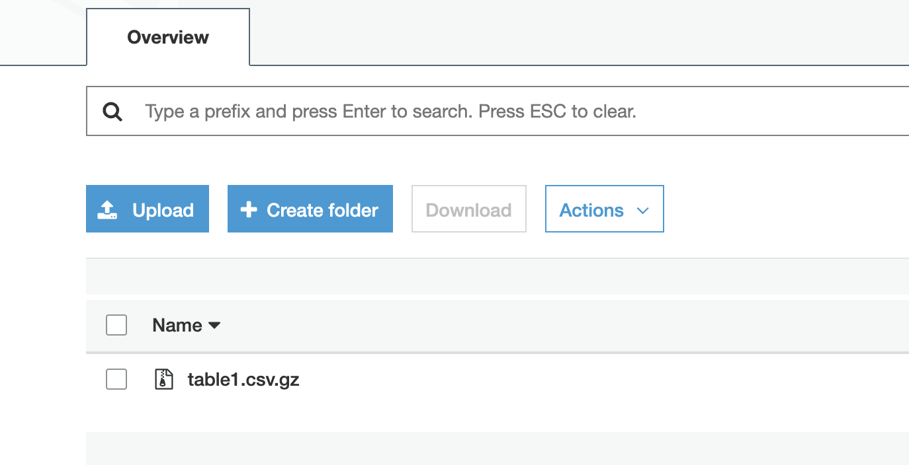

# Data Platform Framework For Easy ETL

## Desciption

- This project is a generic framework to Build & maintain a Data Platform in a Agile way.
- Its written in Python 3.5 and uses Apache Airflow as a workflow management & scheduling tool.
- It helps data engineers to add data sources to analytics data lake in a quick way.
- It also gives the flexibilty to handle file delimiter,add/edit tables,flatten json data  etc

## Tech Stack

- **Programming Language** - Python , Version 3.5
- **Cloud Provider** - AWS
- **Cloud Services** - EC2,S3,IAM
- **Open Source Tools** - Apache Airflow
- **Database** - MySQL , Version 5.6
- **Data Proessing** - Python Pandas
- **File Storage** - AWS S3

## Infra Prerequisites

- Ec2 instance (>= t2Medium)
- Python3.5 installed
- Apache Airflow 1.10 installed
- IAM role attached to EC2 instance for the accessing S3 bucket
- MySQL Server 5.6 or above

- **Note** - Although I have used AWS cloud services like EC2 ,S3 , but you can use any other clould provider ,local server and file storage for running this preoject 


## Features 

- Easy onboarding of new tables to data lake
- Flexibility in chosing file delimiter
- Can handle Both static and Dynamic data (CDC)
- Backfilling of Historical data 
- System automatically detects if a new tables is added and backfills its data , it also makes sure the next time it runs on an incremental load.
- Migrate whole table with just adding a flag
- Choice of selecting specific columns for each table's ETL
- Flatten JSON Columns automatically
- Choice of selecting JSON columns to be flattened
- Email Alerts on Failures/Exceptions


## Project Structure 

```
|__ etl_dag.py
|__ config.yml
|
|__ libs
|   |__ common_utilities.py
|   |__ query_builder.py
|   |__ data_transformation_utilities.py
|
|__ README.md

```


## A few things to add on Airflow console

- Add DB connection in Airflow Connection




- Add table_run_config as Airflow Variable




## Exceution

- Setup code base on Server inside Airflow home folder
- Set the Scheduling Time of ETL in schedule_
interval parameter of DAG
- Make sure the DAG is inside dags folder of Airflow Home
- Tune the config.yml file and mention table names,column names and other  required configurations
- At the scheduler time DAG will run and will create tasks dynamically



- After the DAG is succesfully executed you can check the files must have been created in the s3 path configured by you.




## Future Enhancements

- Currently we are just using a single database to fetch data , in future we can add more databases as well , but just changing config file and making few changes in config parsing
- Currently for Job scheduling we are using daily runs , we can bring that to more granular level . Some changes in Airflow DAG creation & SQL Query Builder will be required
- We can use Apache Hudi to manage our Data Lake in a better way
- For Transformation Python Pandas may not scale for bigger tables , so we can use Apache Spark for Big Data Computations
